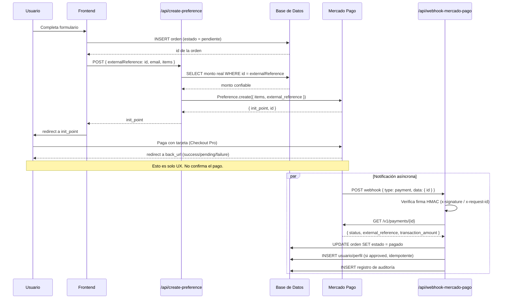

# Guía de Implementación de Mercado Pago (Checkout Pro)

> Referencia genérica basada en la integración de EditMaster (`api/create-preference.js`,
> `api/webhook-mercado-pago.js`), ya con las correcciones de seguridad aplicadas.
> Pensada para copiar/adaptar en un próximo proyecto.

---

## 1. Diagrama de arquitectura (componentes)

```mermaid
flowchart LR
    subgraph FE["Frontend (Browser)"]
        A[Formulario de pago]
    end

    subgraph BE["Backend / Serverless Functions"]
        B["/api/create-preference"]
        C["/api/webhook-mercado-pago"]
    end

    subgraph DB["Base de Datos"]
        D[("Tabla ordenes/solicitudes\nestado: pendiente/pagado/rechazado")]
        E[("Tabla pagos\n(auditoría)")]
        F[("Tabla usuarios/perfiles")]
    end

    subgraph MP["Mercado Pago"]
        G[Preference API]
        H[Checkout Pro\n(hosted)]
        I[Payments API]
        J[Webhook Notifications]
    end

    A -- "1. Envía datos del pedido" --> B
    B -- "2. INSERT orden (pendiente)" --> D
    B -- "3. Crea preferencia\n(monto tomado de la DB, no del cliente)" --> G
    G -- "4. init_point" --> B
    B -- "5. init_point" --> A
    A -- "6. redirect" --> H
    H -- "7. Usuario paga con tarjeta" --> MP
    MP -- "8. Notifica evento 'payment'" --> J
    J -- "9. POST" --> C
    C -- "10. Verifica firma HMAC" --> C
    C -- "11. GET /v1/payments/:id" --> I
    I -- "12. status: approved/pending/rejected" --> C
    C -- "13. UPDATE estado" --> D
    C -- "14. Crea/activa usuario si approved" --> F
    C -- "15. Log de auditoría" --> E
    H -- "16. redirect back_url (solo UX, no confirma nada)" --> A
```

**Idea clave del diagrama:** hay dos caminos separados que NO deben confundirse:
- El camino **6→7→16** es solo experiencia visual del usuario (a dónde vuelve el navegador).
- El camino **8→9→...→13** (el webhook) es la **única fuente de verdad** sobre si el pago se aprobó.

---

## 2. Diagrama de secuencia (orden temporal exacto)



---

## 3. Paso a paso

### 3.1 Elegí el modelo de integración
- **Checkout Pro** (recomendado): creás una preferencia en tu backend, redirigís a `init_point`, MP maneja el formulario de pago. Menor complejidad, sin PCI compliance a tu cargo.
- Alternativa: **Checkout Bricks**, formulario embebido en tu dominio, más control visual pero más trabajo.

### 3.2 Credenciales
1. Cuenta de vendedor en [mercadopago.com/developers](https://www.mercadopago.com.ar/developers).
2. Sacar `Public Key` y `Access Token` de **Sandbox** y de **Producción** (son distintos).
3. Variables de entorno (nunca committear):
   ```bash
   VITE_MP_PUBLIC_KEY=APP_USR_xxxx
   MP_ACCESS_TOKEN=APP_USR_xxxx
   MP_WEBHOOK_SECRET=xxxx   # se genera al crear el webhook (paso 3.6)
   ```

### 3.3 Backend — crear la preferencia (`/api/create-preference`)
Reglas no negociables (aprendidas de incidentes reales en este mismo proyecto):
- **Nunca confiar en el precio que manda el cliente.** El frontend primero inserta la orden en la DB con estado `pendiente`; el backend recibe solo el `id` (`external_reference`) y busca el monto real en la DB.
- CORS con **whitelist explícita** de orígenes, nunca `*`.
- Validar email, cantidad de items, moneda, rango de precios.
- Poner `expiration_date_to` (ej. 24 h) para que la preferencia no quede viva indefinidamente.
- Responder solo `{ init_point, id }` — nunca el access token ni datos internos.

### 3.4 Frontend
- Insertar la orden en la DB **antes** de pedir la preferencia (estado `pendiente`).
- Llamar a `/api/create-preference` con ese `id` como `externalReference`.
- Redirigir a `init_point`.
- Las `back_urls` (`success`/`pending`/`failure`) son solo UX. **No marcar nada como pagado según el query param de retorno** — se falsifica cambiando la URL a mano.

### 3.5 Webhook — la parte crítica (`/api/webhook-mercado-pago`)
1. Recibe `POST` con `{ type: 'payment', data: { id } }`.
2. **Verificar firma HMAC** (`x-signature` + `x-request-id` contra `MP_WEBHOOK_SECRET`) antes de procesar nada.
3. Con el `paymentId`, consultar `GET https://api.mercadopago.com/v1/payments/{id}` — nunca confiar en el body del webhook para status/monto, siempre re-consultar la API.
4. Según `status` (`approved` / `pending` / `rejected`), actualizar la orden por `external_reference`.
5. Si `approved`: crear usuario / entregar producto, de forma **idempotente** (chequear que no esté ya en `pagado` antes de repetir la creación — MP puede reenviar el mismo evento varias veces).

### 3.6 Registrar el webhook en MP
Panel Developers → Webhooks → URL de tu endpoint → eventos `payment.created` y `payment.updated`.
En local, exponer con `ngrok http <puerto>` para poder recibir el POST real de MP.

### 3.7 Modelo de datos mínimo
- Tabla de orden: `estado` (pendiente/pagado/rechazado), `mp_payment_id`, `fecha_pago`, `monto`.
- Tabla `pagos` separada como historial/auditoría (no crítica para la lógica de negocio).

### 3.8 Testing (Sandbox)
| Resultado | Número de tarjeta | CVV | Vencimiento |
|---|---|---|---|
| Aprobada | `4111 1111 1111 1111` | `123` | cualquier fecha futura |
| Rechazada | `4000 0000 0000 0002` | `123` | cualquier fecha futura |

---

## 4. Checklist pre-producción

- [ ] Credenciales de **producción** cargadas en las env vars del hosting (no las de sandbox)
- [ ] `MP_WEBHOOK_SECRET` configurado y validación de firma activa
- [ ] CORS restringido al dominio real de producción
- [ ] Precio siempre resuelto server-side vía `external_reference`, nunca desde el cliente
- [ ] Webhook idempotente (no duplica usuarios/entregas si MP reenvía el evento)
- [ ] Webhook registrado con la URL de producción (no localhost)
- [ ] Un pago real de bajo monto probado end-to-end antes de anunciar el lanzamiento

---

## 5. Errores comunes

| Problema | Causa probable |
|---|---|
| Webhook no recibe eventos | URL mal registrada, o con `/` de más al final |
| `Payment not found` | El `external_reference` no coincide con ningún registro |
| Usuario no se crea tras pago aprobado | `SERVICE_ROLE_KEY` (o equivalente) inválido o sin permisos |
| Pago aprobado pero estado no cambia en la DB | Webhook caído, o firma HMAC rechazando el request |
| Firma inválida siempre | `MP_WEBHOOK_SECRET` no coincide con el que generó MP al crear el webhook |
